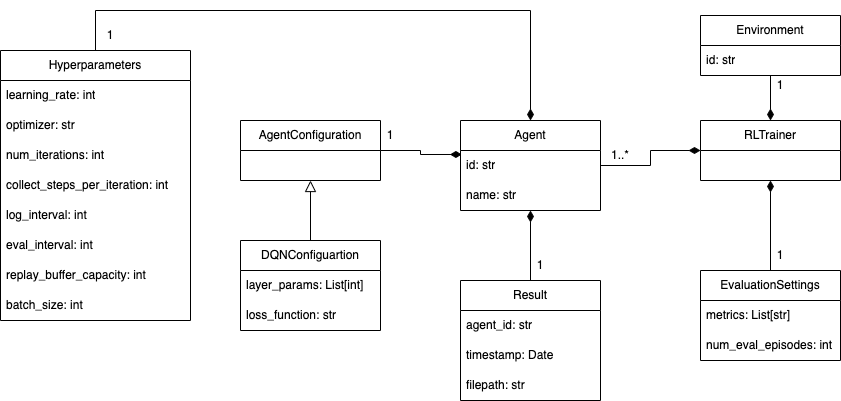

# BSP5
This project was developed as part of the 'Bachelor Semester Project' (BSP) in the Computer Science bachelor's program at the University of Luxembourg. It aims to explore the creation of reinforcement components using the low-code platform BESSSER.
## Installation
To set up this project, ensure that the required dependencies are installed:

1. Install BESSSER
Follow the official BESSSER installation guide.

2. Install TF-Agents
Follow the official TF-Agents installation guide.
## Example
You have an example of model creation and code generation [here](/BSP5/test_example.py) and the corresponding [output](/BSP5/output_example) is also available.
## Metamodel

## Licence
This project is licensed under the MIT license.
